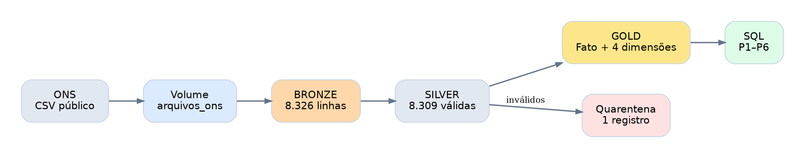
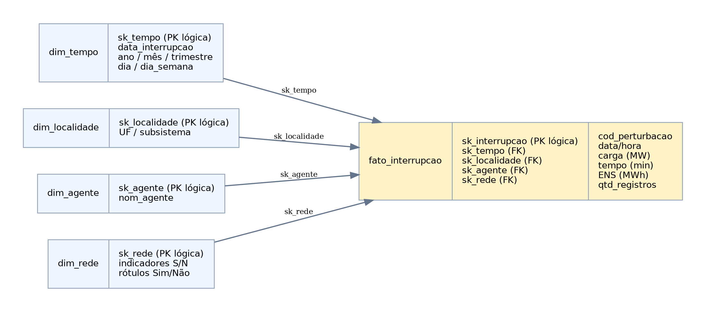

# MVP de Engenharia de Dados — Interrupções de Carga do ONS

Projeto de engenharia e análise de dados desenvolvido no Databricks, utilizando dados públicos do Operador Nacional do Sistema Elétrico (ONS). A solução implementa uma arquitetura Medallion (Bronze, Silver e Gold), tratamento e validação de dados, modelagem dimensional em esquema estrela e análises exploratórias orientadas a perguntas de negócio.

O projeto foi desenvolvido como MVP acadêmico no contexto da pós-graduação em Ciência de Dados e Analytics da PUC-Rio.

## 1. Objetivo

Construir um pipeline de dados capaz de transformar registros públicos de interrupção de carga em uma base estruturada, rastreável e adequada à análise.

Os objetivos específicos são:

- Ingerir os dados originais preservando sua estrutura e procedência.
- Padronizar tipos, tratar duplicidades e identificar registros inválidos.
- Organizar os dados em um modelo dimensional.
- Implementar verificações de qualidade e reconciliação entre camadas.
- Responder a seis perguntas de negócio por meio de consultas SQL.
- Documentar as decisões técnicas e as limitações dos resultados.

### Perguntas de negócio planejadas

1. **P1:** Como evoluíram a frequência das interrupções e a energia não suprida ao longo dos anos?
2. **P2:** Quais estados e subsistemas concentram os maiores volumes de carga interrompida e energia não suprida?
3. **P3:** Como varia o tempo médio de recomposição entre estados e subsistemas?
4. **P4:** Como diferem as interrupções que envolveram ou não a Rede Básica?
5. **P5:** Existe comportamento mensal ou sazonal na frequência e magnitude das interrupções?
6. **P6:** Quais perturbações concentraram os maiores volumes de energia não suprida?

As respostas, consultas e limitações são apresentadas na seção 6 e no notebook [`05_analise_final.ipynb`](05_analise_final.ipynb).

## 2. Fonte de dados

**Fonte:** Operador Nacional do Sistema Elétrico (ONS).

**Fonte oficial e recursos:** [Conjunto Interrupção de Carga — ONS Dados Abertos](https://dados.ons.org.br/dataset/interrupcao_carga), incluindo [recurso CSV](https://dados.ons.org.br/dataset/interrupcao_carga/resource/e87dfb42-d713-41b6-81d3-df21d3caab31) e [dicionário JSON](https://dados.ons.org.br/dataset/interrupcao_carga/resource/cbda0486-fc65-46be-b0b1-d04174cd7eda).

**Coleta e recorte:** foi utilizada uma cópia do CSV público, disponibilizada manualmente no Volume do Databricks. A versão analisada possui 8.326 linhas e última ocorrência em 01/09/2026. Data da coleta: 03/09/2026. Os arquivos CSV e dicionário de dados foram obtidos no portal oficial de Dados Abertos do ONS nessa data. A versão analisada contém 8.326 registros, com última ocorrência registrada em 01/09/2026. Como o conjunto é atualizado pelo ONS, extrações posteriores poderão apresentar contagens diferentes. O portal mantém atualizações do conjunto; uma nova extração poderá apresentar contagens diferentes. O arquivo e o dicionário foram consultados como referência da fonte, mas não estão versionados neste repositório.

**Procedimento de obtenção:** acessar o conjunto oficial, abrir o recurso CSV e baixar o arquivo; consultar o dicionário no mesmo portal. No Databricks, criar/verificar o Volume com `00_configuracao`, enviar o CSV para `/Volumes/ons_energia/bronze/arquivos_ons/INTERRUPCAO_CARGA.csv` e executar `01_ingestao_bronze`. A ingestão usa CSV UTF-8, separador `;`, cabeçalho e esquema explícito. O nome local é o esperado pelo notebook.

**Conjunto utilizado:** Interrupção de Carga.

**Arquivo de entrada:** `INTERRUPCAO_CARGA.csv`.

**Dicionário:** `DicionarioDados_InterrupcaoDadosl.json`.

A base original contém 8.326 registros e 11 campos, com informações sobre perturbações, datas, subsistemas, estados, agentes, carga interrompida, tempo médio de recomposição, energia não suprida e indicadores de envolvimento das redes.

O período observado vai de 2007 a 2026. Os dados de 2026 são parciais, com última data registrada em 01/09/2026.

Principais medidas:

| Campo | Descrição | Unidade |
|---|---|---|
| `val_cargainterrompida_mw` | Carga interrompida registrada | MW |
| `val_tempomedio_minutos` | Tempo médio para recompor a carga | minutos |
| `val_energianaosuprida_mwh` | Energia não suprida | MWh |

O código `cod_perturbacao` identifica a perturbação na fonte. Uma mesma perturbação pode estar associada a múltiplos registros de agentes e localidades.

> **Escopo:** o conjunto representa registros de interrupção de carga disponibilizados pelo ONS. Não corresponde à totalidade das interrupções nas redes de distribuição e não deve ser confundido com uma base de indicadores DEC/FEC.

## 3. Tecnologias utilizadas

- Databricks Free Edition;
- Apache Spark e PySpark;
- Spark SQL;
- Delta Lake;
- Unity Catalog;
- Git e GitHub;
- Notebooks para implementação, validação e análise.

## 4. Arquitetura da solução

A solução utiliza a arquitetura Medallion, com três camadas de dados.

O catálogo utilizado no Databricks é `ons_energia`, com os schemas `bronze`, `silver` e `gold`.

### 4.1. Bronze — ingestão

A camada Bronze preserva os 11 campos originais como texto e acrescenta metadados de rastreabilidade:

- `_data_ingestao`;
- `_arquivo_origem`;
- `_fonte_dados`.

Tabela principal:

`ons_energia.bronze.bronze_interrupcao_carga`

**Resultado:** 8.326 registros ingeridos.

A preservação dos valores originais permite auditar as transformações aplicadas nas etapas seguintes.

### 4.2. Silver — tratamento e validação

A camada Silver realiza:

- Conversão de datas e medidas numéricas;
- Padronização de tipos;
- Remoção de duplicatas integrais considerando os 11 campos de negócio;
- Verificação de valores ausentes e medidas negativas;
- Separação de registros inválidos em tabela de quarentena;
- Enriquecimento com atributos temporais.

Tabelas principais:

- `ons_energia.silver.silver_interrupcao_carga`;
- `ons_energia.silver.silver_registros_invalidos`.

**Resultado:** 8.309 registros válidos e um registro isolado em quarentena.

O registro inválido apresentou valores negativos de tempo de recomposição e energia não suprida. Ele foi preservado na quarentena para rastreabilidade, sem integrar as análises Gold.

### 4.3. Gold — modelagem dimensional

A camada Gold organiza os dados em um esquema estrela, com uma tabela fato e dimensões de tempo, localidade, agente e rede.

A tabela `ons_energia.gold.fato_interrupcao` contém 8.309 registros, com chaves substitutas e medidas analíticas.

As dimensões permitem consultar as medidas sob diferentes perspectivas sem repetir a lógica de tratamento dos dados.

A solução também mantém tabelas auxiliares com evidências de qualidade, incluindo completude, identificação de valores extremos e avaliação da granularidade.

O dicionário de tabelas, atributos, tipos, chaves, granularidade e regras está em [`CATALOGO_DADOS.md`](CATALOGO_DADOS.md). As chaves documentadas são lógicas e verificadas por testes no código; não se pressupõe a criação de restrições físicas de chave estrangeira.

## 5. Qualidade e reconciliação dos dados

A reconciliação entre as camadas apresentou os seguintes resultados:

| Etapa | Registros |
|---|---:|
| Bronze — registros originais | 8.326 |
| Duplicatas integrais removidas | 16 |
| Registros inválidos isolados | 1 |
| Silver — registros válidos | 8.309 |
| Gold — registros na tabela fato | 8.309 |

Foram verificados:

- Ausência de valores nulos nos 11 campos de negócio;
- Integridade das chaves da tabela fato;
- Correspondência dos registros da fato com as dimensões;
- Validade das medidas numéricas;
- Duplicidade integral;
- Distribuição e valores extremos;
- Consistência entre o ano da data e o ano incorporado ao código da perturbação.

### Decisões de qualidade

**Duplicatas:** foram removidas somente as linhas integralmente repetidas nos campos de negócio. Não foi aplicada deduplicação por `cod_perturbacao`, pois uma perturbação pode gerar múltiplos registros legítimos.

**Valores extremos:** os valores positivos elevados foram preservados. Um valor estatisticamente extremo não comprova, isoladamente, erro de origem.

**Divergência de ano:** foram identificados 201 registros nos quais o ano do código da perturbação difere do ano da data registrada. As análises temporais utilizam `din_interrupcaocarga`, preservando o código original.

**Granularidade:** a validação realizada na base não encontrou códigos de perturbação associados a mais de uma data de interrupção. Assim, o agrupamento por código foi mantido na análise de concentração de ENS.

## 6. Perguntas de negócio e principais resultados

As análises utilizam os registros válidos da camada Gold.

### P1 — Como evoluíram a frequência das interrupções e a energia não suprida?

A quantidade de registros e a ENS não evoluem necessariamente de forma proporcional.

- **2023:** maior frequência anual, com 573 registros e 63.958,83 MWh de ENS.
- **2009:** maior ENS anual, com 107.825,41 MWh em 474 registros.
- **2020:** 98.919,49 MWh em 318 registros.

Os resultados indicam que perturbações de elevada magnitude podem influenciar significativamente os totais anuais mesmo em períodos com menor frequência.

O ano de 2026 é parcial e não foi tratado como equivalente a um ano completo.

### P2 — Quais estados e subsistemas concentram os maiores impactos?

São Paulo apresentou a maior ENS acumulada entre os estados, com **117.406,88 MWh**.

O Amapá apresentou **88.038,08 MWh em 108 registros**, com forte influência de uma ocorrência individual de 77.509,63 MWh.

O Rio Grande do Sul apresentou a maior quantidade de registros entre os estados, com 1.020, mas não a maior ENS.

Por subsistema:

| Subsistema | Registros | ENS (MWh) |
|---|---:|---:|
| Sudeste/Centro-Oeste | 3.316 | 315.060,07 |
| Norte | 2.233 | 294.339,02 |
| Nordeste | 1.318 | 203.725,38 |
| Sul | 1.442 | 83.991,71 |

As comparações representam valores absolutos, sem normalização pela carga atendida, quantidade de consumidores ou extensão da rede.

### P3 — Como varia o tempo de recomposição?

A distribuição dos tempos é assimétrica e apresenta valores extremos relevantes.

O Amapá registrou média de **378,73 minutos** e mediana de **40,75 minutos**. No Rio Grande do Sul, a média foi de **125,81 minutos** e a mediana de **13,43 minutos**.

Por subsistema, o Sul apresentou a maior média (**103,19 minutos**), enquanto o Nordeste apresentou a maior mediana (**22,95 minutos**).

A análise conjunta de média e mediana evita que ocorrências excepcionais sejam confundidas com o comportamento central dos registros.

### P4 — Como diferem as interrupções com e sem envolvimento da Rede Básica?

| Indicador | Com envolvimento | Sem envolvimento |
|---|---:|---:|
| Registros | 6.210 | 2.099 |
| Carga média por registro (MW) | 95,94 | 55,24 |
| ENS acumulada (MWh) | 755.980,96 | 141.135,21 |
| ENS média por registro (MWh) | 121,74 | 67,24 |
| Tempo médio (min) | 62,40 | 79,19 |
| Tempo mediano (min) | 16,00 | 9,38 |

Os registros com envolvimento da Rede Básica apresentaram maiores valores médios de carga interrompida e ENS. A relação entre os grupos e o tempo de recomposição varia conforme a medida estatística utilizada.

Trata-se de comparação descritiva, sem inferência de causalidade.

### P5 — Existe comportamento mensal ou sazonal?

Na série de 2007 a 2025, outubro apresentou a maior frequência acumulada, com **940 registros**, enquanto julho apresentou a menor, com **425 registros**.

Novembro apresentou a maior ENS acumulada, com **202.462,71 MWh**.

A matriz ano × mês mostrou que parte desse volume está concentrada em períodos excepcionais, como novembro de 2009 e novembro de 2020. Portanto, os picos mensais de ENS não devem ser interpretados automaticamente como um padrão sazonal recorrente.

### P6 — Quais perturbações concentraram os maiores impactos energéticos?

| Código | Registros | Estados | ENS (MWh) |
|---|---:|---:|---:|
| `0672/2011` | 29 | 18 | 89.371,48 |
| `6814/2020` | 1 | 1 | 77.509,63 |
| `5799/2018` | 66 | 26 | 51.692,18 |
| `5598/2023` | 116 | 26 | 48.106,22 |
| `5783/2012` | 14 | 12 | 37.518,45 |

As cinco perturbações com maior ENS concentram aproximadamente **33,90%** do total da base; as dez primeiras, **45,17%**; e as vinte primeiras, **53,06%**.

O código `0672/2011` possui data registrada em 2009. Por isso, seu impacto integra o ano de 2009 nas análises temporais.

A concentração ocorre tanto em perturbações de ampla abrangência quanto em registros individuais de longa duração.

## 7. Organização e execução dos notebooks

A implementação foi dividida em etapas sequenciais:

| Notebook | Finalidade |
|---|---|
| [`00_configuracao`](00_configuracao.ipynb) | Configuração inicial do catálogo, schemas e caminhos |
| [`01_ingestao_bronze`](01_ingestao_bronze.ipynb) | Leitura da fonte e ingestão rastreável |
| [`02_refino_silver`](02_refino_silver.ipynb) | Conversão, padronização, deduplicação e quarentena |
| [`03_modelagem_gold`](03_modelagem_gold.ipynb) | Criação do esquema estrela |
| [`04_qualidade_dados`](04_qualidade_dados.ipynb) | Validações e reconciliação das camadas |
| [`05_analise_final`](05_analise_final.ipynb) | Consultas SQL e respostas às seis perguntas |

Para reproduzir o projeto:

1. Obtenha o CSV no [portal oficial do ONS](https://dados.ons.org.br/dataset/interrupcao_carga), consulte o dicionário e carregue o CSV no Volume `/Volumes/ons_energia/bronze/arquivos_ons/` com o nome `INTERRUPCAO_CARGA.csv`. O arquivo não está incluído no GitHub.
2. Revise os caminhos e identificadores definidos em `00_configuracao`.
3. Execute os notebooks na ordem apresentada.
4. Confira os resultados de reconciliação em `04_qualidade_dados`.
5. Execute `05_analise_final` para consultar os indicadores e visualizar as análises.

O ambiente de execução deve permitir o uso de Spark, Delta Lake e Unity Catalog. A ingestão e as tabelas derivadas são gravadas por **carga integral com `overwrite`**; não há atualização incremental nem agendamento automático nesta versão. As contagens esperadas correspondem ao recorte da fonte utilizado no MVP.

**Importante:** o GitHub versiona o código e a documentação. As tabelas Delta e os arquivos armazenados no Volume permanecem no ambiente de dados e não são recriados apenas pela clonagem do repositório.

## 8. Limitações

- A base representa registros públicos de interrupção de carga do ONS, não todas as interrupções da distribuição.
- O ano de 2026 possui cobertura parcial.
- O ano incorporado ao código da perturbação pode divergir do ano da data registrada.
- Valores extremos positivos foram mantidos e podem influenciar médias e totais.
- A soma de cargas interrompidas por registro não representa potência simultaneamente interrompida.
- A frequência de registros não equivale necessariamente à quantidade de perturbações.
- As comparações geográficas não foram normalizadas por características dos sistemas.
- Os resultados são descritivos e não permitem atribuir automaticamente causas aos eventos.

## 9. Autoavaliação do projeto

Considero que os objetivos propostos para este MVP foram alcançados dentro do escopo acadêmico. Foi desenvolvida uma solução de engenharia de dados no Databricks, utilizando a arquitetura Medallion, com ingestão, tratamento, validação e modelagem dimensional dos registros de interrupção de carga do ONS. As seis perguntas de negócio foram respondidas por meio de consultas SQL, permitindo explorar os impactos energéticos, temporais, geográficos e operacionais das interrupções.

O desenvolvimento exigiu atenção especial à granularidade dos registros, ao tratamento de duplicatas, à identificação de dados inválidos e à interpretação de valores extremos. Essas decisões reforçaram a importância de compreender o contexto dos dados antes de transformá-los. Como limitações, destacam-se a carga integral sem automatização do pipeline e a cobertura parcial dos dados de 2026, aspectos que poderão ser aprimorados em evoluções futuras.

O projeto foi elaborado com o auxílio de ferramentas de inteligência artificial generativa, utilizadas como apoio ao aprendizado, à elaboração e revisão de códigos, à documentação e à análise dos resultados. As sugestões foram avaliadas e ajustadas conforme os requisitos do trabalho e os resultados obtidos no Databricks. A execução, as decisões técnicas e a validação final permaneceram sob minha responsabilidade. Essa experiência contribuiu para o desenvolvimento de competências em engenharia de dados e reforçou a importância do uso crítico e responsável da inteligência artificial.

## 10. Referência da fonte

Operador Nacional do Sistema Elétrico (ONS) — [Interrupção de Carga](https://dados.ons.org.br/dataset/interrupcao_carga), [recurso CSV](https://dados.ons.org.br/dataset/interrupcao_carga/resource/e87dfb42-d713-41b6-81d3-df21d3caab31) e [dicionário JSON](https://dados.ons.org.br/dataset/interrupcao_carga/resource/cbda0486-fc65-46be-b0b1-d04174cd7eda).

Consulte os canais oficiais de dados abertos do ONS para obter a versão atualizada da fonte.

---

Projeto acadêmico desenvolvido para fins de estudo e demonstração de competências em Engenharia de Dados e Analytics.
